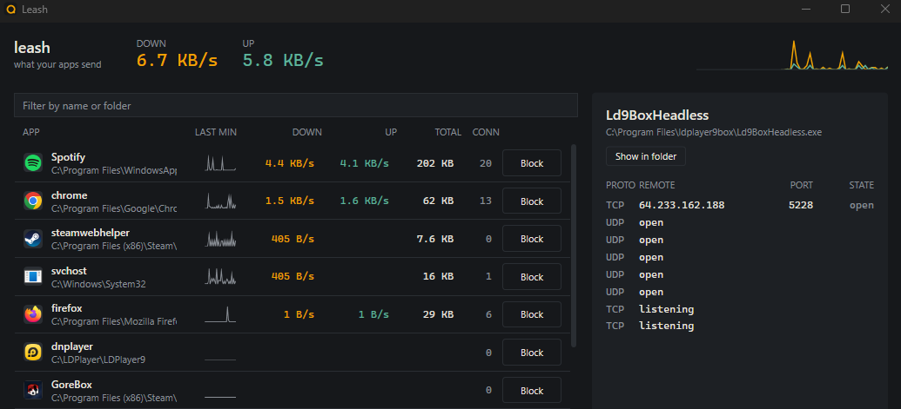

# Leash

See which programs on your PC talk to the internet, how much they send, and
where. Cut any of them off with one click.

A free, open source alternative to GlassWire and NetLimiter for Windows 10 and 11.
No driver, no account, no telemetry. One exe.



## What it does

- Lists every app with a network connection, grouped by executable, with live
  download and upload speed and a one-minute graph.
- Shows each app's connections with the host name it looked up, not just a bare
  IP, so you see `telemetry.example.com` instead of `52.114.7.3`.
- Blocks an app with one click. Leash adds a normal Windows Firewall rule for
  that exe (group "Leash"), so the block stays even when Leash isn't running,
  and you can remove it from Windows Firewall settings too.
- Tells you when an app goes online for the first time.
- Lives in the tray. Close the window and it keeps watching.

## Download

Grab `Leash.exe` from [Releases](https://github.com/himi9046-hub/leash/releases).
Nothing to install; it's a single self-contained file.

Leash starts without admin rights and shows connections right away. Live
traffic, host names and blocking need administrator rights, and there's a button
in the window to restart elevated.

Windows SmartScreen may warn about an unsigned exe the first time. Click "More
info" and "Run anyway", or build it yourself.

## How it works

- Connections come from the Windows IP Helper API (`GetExtendedTcpTable`,
  `GetExtendedUdpTable`), the same data `netstat -ano` prints.
- Traffic per process comes from the kernel's own TCP/IP event tracing (ETW),
  read with [TraceEvent](https://github.com/microsoft/perfview). Nothing sits in
  the network path, so Leash can't slow your connection down or break it.
- Host names come from the Windows DNS client's event log, so they match the
  names apps actually asked for.
- Blocking uses Windows Firewall rules through its COM API.

## Build

Needs the .NET 10 SDK.

```
dotnet test
dotnet run --project src/Leash
```

Single-file build, same as the release:

```
dotnet publish src/Leash -c Release -r win-x64 --self-contained true -p:PublishSingleFile=true -p:IncludeNativeLibrariesForSelfExtract=true -o out
```

## Limits

- Traffic counts are per process and per second. They are close to what Task
  Manager shows, not packet-exact.
- Apps inside `svchost.exe` share one row. Blocking svchost would cut off a lot
  of Windows, so think before you press it.
- Blocking relies on Windows Firewall being on.

## License

MIT
